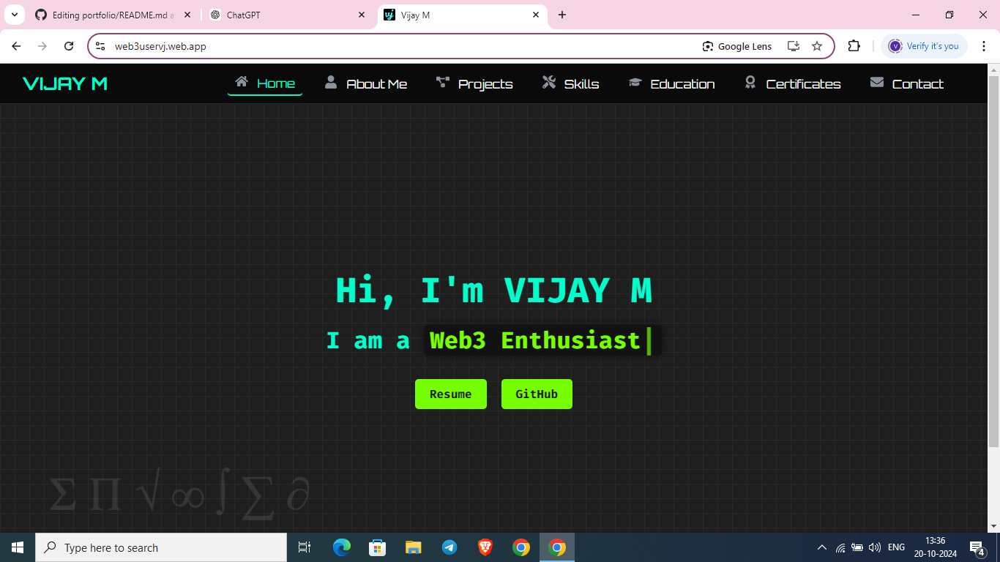
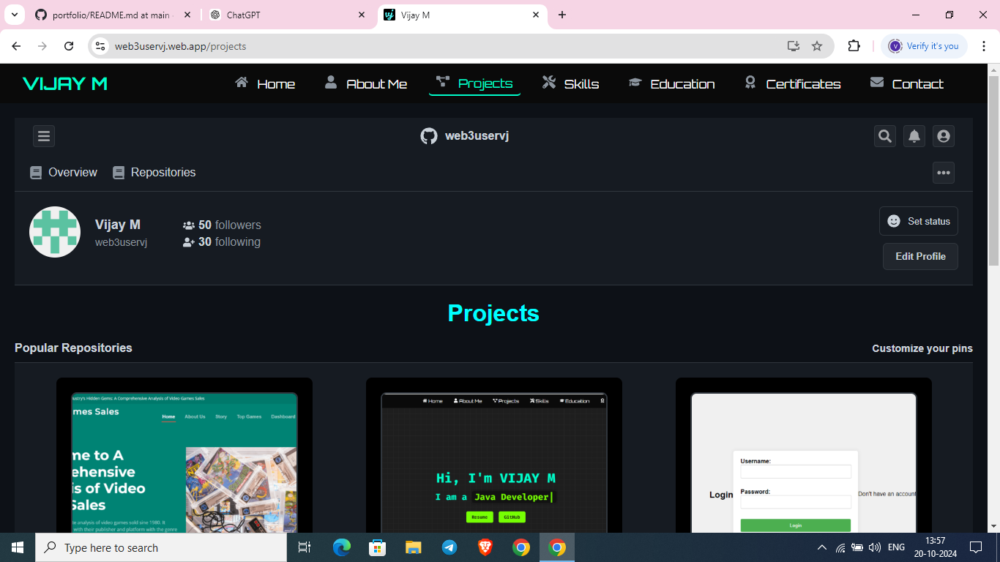
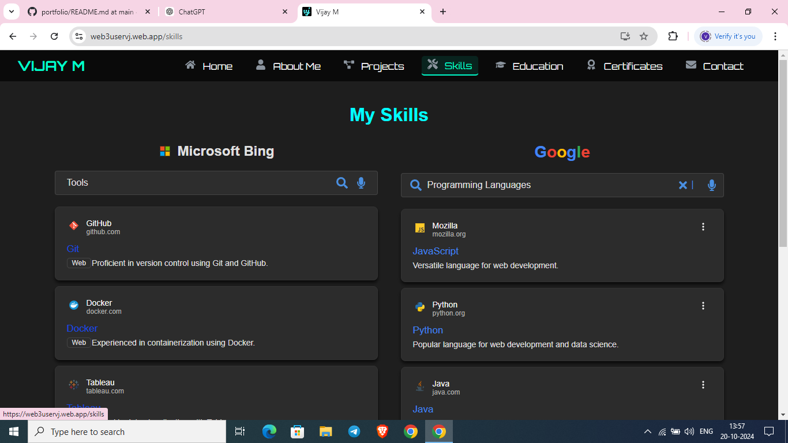

# portfolio

# Vijay M's React Portfolio

## Overview
This is my personal portfolio built using **React** to showcase my skills, projects, and experiences. The portfolio follows a **dark theme** with **Web3** and **cryptocurrency** elements, featuring a futuristic and professional design. It includes multiple sections like **Home**, **About Me**, **Projects**, **Skills**, **Education**, **Certificates**, and **Contact**.

## Screenshots

### Home Page


### Projects Page


### Skills Page



### Live Demo
You can visit the live version of the portfolio [https://web3uservj.web.app/](#).

## Features
- **Dynamic Hero Section**: The hero section uses a Web3-inspired theme, including dynamic background color changes and a typewriter effect displaying my name and role. 
- **Responsive Design**: Fully responsive across all screen sizes, with mobile-first optimizations.
- **Custom Themes**: Includes themes based on Web3, cryptocurrency, and mathematics, creating a futuristic and unique user experience.
- **Project Showcase**: Displays my projects using cards with a black background, smaller images, and three-column layout on desktop and two-column on mobile. 
- **Timeline for Education**: The education section follows a roadmap design with milestone animations and a vertical train track-themed timeline.
- **Skills Section**: The skills section is styled like a **Google search engine**, **Bing** for tools, and **Yahoo** for soft skills, using a graph model and unique designs.
- **Certificates Section**: A dark theme layout with Instagram-style icons below the certificate images (like, comment, share).

## Sections
- **Home**: Contains the hero banner with a typewriter effect.
- **About Me**: Styled like a macOS terminal, this section provides a professional introduction to who I am, my education, and interests.
- **Projects**: Displays a selection of my projects built with different technologies .
- **Skills**: Includes a graph-based layout to showcase my programming languages, tools, and soft skills, using themes from Google, Bing.
- **Education**: A train track-themed timeline showing my academic milestones.
- **Certificates**: Displays my certificates, each styled with dark tones and Instagram-like interaction icons.
- **Contact**: Follows a formal Web3-inspired theme with a professional layout for reaching out.

## Technologies Used
- **React** (v18.2.0)
- **React Router** for page navigation
- **Typewriter Effect** for dynamic text
- **React Icons** for icons and interactions
- **CSS** for custom styling
- **@heroicons/react** for interactive icons

## Installation

1. Clone the repository:
   ```bash
   git clone https://github.com/web3uservj/portfolio.git

2. Create react app:
     ```bash
     npx create-react-app portfolio

3. Change directory:
   ```bash
   cd portfolio

## Package Installation

### Core Dependencies

To get the project running, you’ll need to install the following core dependencies:

| Package          | Command to Install                  |
|------------------|-------------------------------------|
| **React**        | `npm install react`                 |
| **React DOM**    | `npm install react-dom`             |
| **React Router** | `npm install react-router-dom`      |

### Additional Dependencies

These additional packages are required for specific features and animations within the app:

| Package                       | Command to Install                       |
|-------------------------------|------------------------------------------|
| **@heroicons/react**           | `npm install @heroicons/react`           |
| **React Icons**                | `npm install react-icons`                |
| **Typewriter Effect**          | `npm install typewriter-effect`          |
| **Framer Motion**              | `npm install framer-motion`              |
| **React Spring**               | `npm install react-spring`               |
| **Lazy Load Image Component**  | `npm install react-lazy-load-image-component` |


5.Start the development server:
 ```bash
npm start
